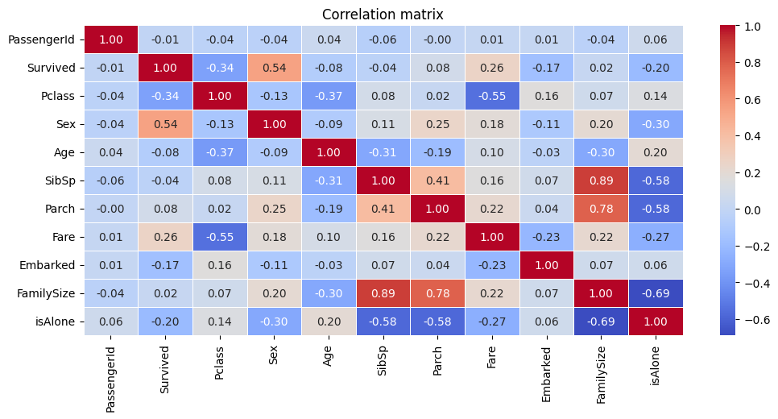
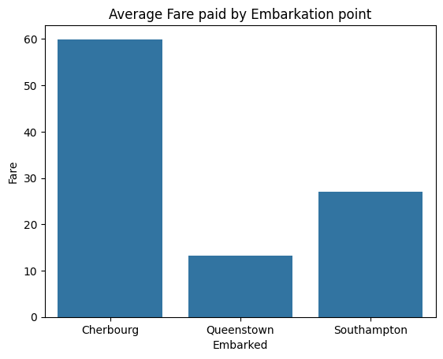
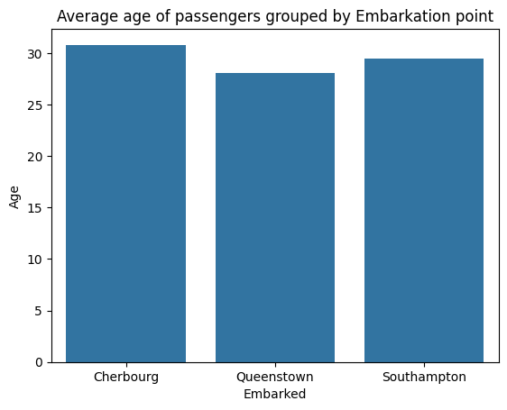
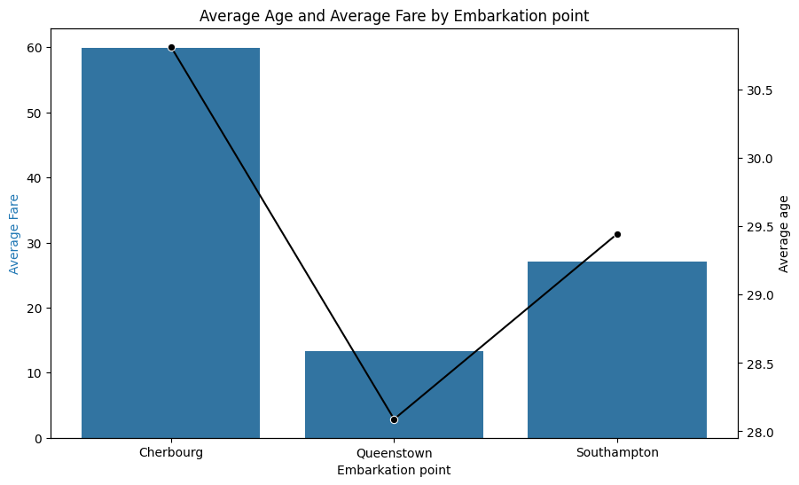
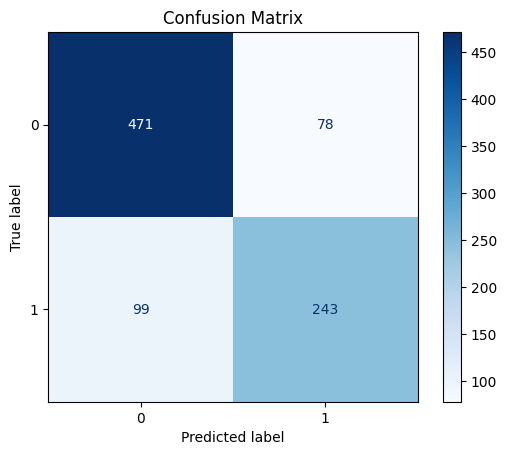

# Charts and graphs from data
This file contains all of the charts and graphs that were obtained from the training data (`data/train.csv` - [link](data/train.csv))

## correlation matrix for the data

## average fare paid by embarkation point

## Average age of passengers grouped by Embarkation point

## Average Age and Average Fare by Embarkation point

## confusion matrix obtained from logistic regression
